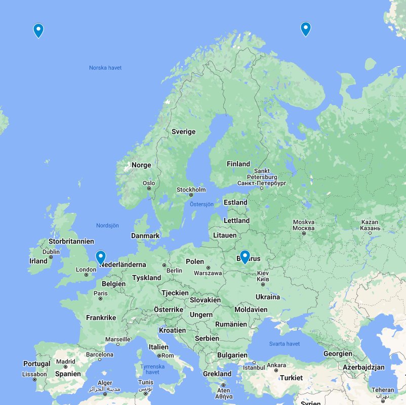

= Weather App

Weather App is a custom Java Swing application that uses the SMHI API to display a 10-day weather forecast based on the user's location (IP).

It retrieves the user's public IP address using the ipify.org API and determines the GEO location (latitude and longitude) with ipinfo.io. This GEO location is then used to query the SMHI API for the weather forecast.

== Information

The app only works withing in certain coordinates since it's relying on SMHI's API. It works within the 4 points

=== It works regardless of city in these countries.
* Sweden
* Norway
* Finland
* Dennmark
* Estonia
* Latvia
* Lithuania

== Usage

=== Option 1: Compile it Yourself

1. Clone the repository:
   `git clone https://github.com/axelwesselgren/weatherApp.git`
2. Navigate into the project directory:
   `cd weatherApp`
3. Use Maven to build and package the project:
   `mvn clean install package`
4. Run the application:
   `java -jar target/weatherapp-1.0-jar-with-dependencies.jar`

_Requirements:_

* Java JDK 8+

* Maven

=== Option 2: Run the Pre-built Executable (Windows)

If you're on Windows, you can download and run the executable directly:

link:https://github.com/axelwesselgren/weatherApp/raw/main/WeatherApp.exe[Download WeatherApp.exe]

== Features

* 10-day weather forecast
* Optional precision
* Metric or Imperial units
* Lightweight - 451kb JAR - 3.58mb EXE
* Open-source

== URLs

The application interacts with the following APIs:

* **SMHI:** Retrieve weather data from https://opendata-download-metfcst.smhi.se/api/category/pmp3g/version/2/geotype/point/lon/{longitude}/lat/{latitude}/data.json
* **IPify:** Obtain public IP address from https://api.ipify.org?format=json
* **ipinfo.io:** Get GEO location from https://ipinfo.io/{IP}/json

---

© Axel Lönnby Wesselgren (https://github.com/axelwesselgren)
